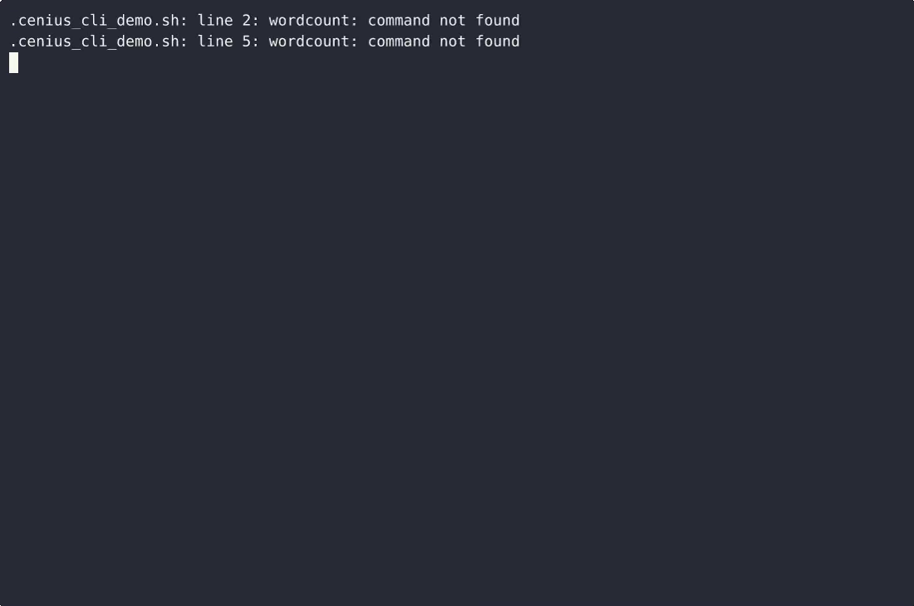
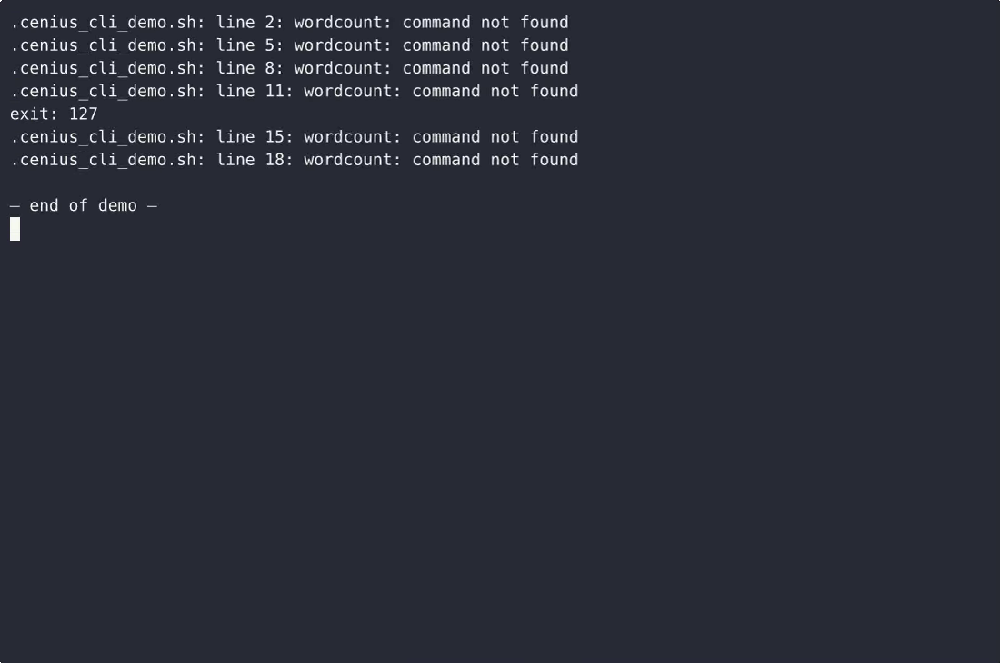

# WordCount CLI — complete Full-stack app command-line tool example app

Need a self-hosted command-line tool? **WordCount CLI** is the open-source answer: a Full-stack app project you can clone, run, and own. Build a single-file plain-Python CLI that reads one text file and prints the number of whitespace-separated words, with minimal usage help and readable file errors. Every WordCount CLI line of code is here — no stripped demo, no paywalled features. Apache-2.0-licensed; [remix WordCount CLI on cenius.ai](https://cenius.ai/marketplace/p/wordcount-cli-3?ref=gh&utm_campaign=wordcount-cli-webapp-3) for a bespoke custom version.


[](LICENSE)  [](https://cenius.ai)

[](https://cenius.ai/marketplace/p/wordcount-cli-3?ref=gh&utm_campaign=wordcount-cli-webapp-3)

> **▶ [Open & edit in cenius.ai](https://cenius.ai/marketplace/p/wordcount-cli-3?ref=gh&utm_campaign=wordcount-cli-webapp-3)** — one click to an editable workspace: describe changes in plain English, get an instant preview, one-click deploy and host. Modifications made on the platform come with full rebrand & relicense rights.

_Local clone? See [Quick start](#quick-start) below. cenius.ai is the zero-setup path._

## Demo


▶ **[Full demo walkthrough](https://cenius.ai/marketplace/p/wordcount-cli-3?ref=gh&utm_campaign=wordcount-cli-webapp-3)** — watch it on the project page · [download MP4](.github/media/demo.mp4)

## Screenshots

 

## Usage guide

Every example below is copy-pasteable and uses the bundled files in `examples/`
so you can compare your output with this page.

### Count the words in a file

```console
$ python3 wordcount.py examples/sample.txt
examples/sample.txt: 137 words
```

The count is the number of non-empty tokens produced by splitting the file's
text on any run of whitespace (spaces, tabs, newlines). Punctuation stays
attached, so `well-known, that's it.` is three words, and an accented word like
`café` stays one word — the file is decoded as UTF-8 before it is split.

### Empty and whitespace-only files

```console
$ python3 wordcount.py examples/empty.txt
examples/empty.txt: 0 words
$ python3 wordcount.py examples/whitespace.txt
examples/whitespace.txt: 0 words
```

`0 words` is printed rather than a blank line, and the exit status is still `0`:
an empty file is a successful count, not an error.

### Scripting: one JSON object per run

```console
$ python3 wordcount.py --json examples/notes.md
{"file": "examples/notes.md", "words": 110}
```

```bash
## The counting pipeline this tool is built for:
total=0
for f in chapters/*.txt; do
  n=$(python3 wordcount.py --json "$f" | python3 -c 'import json,sys; print(json.load(sys.stdin)["words"])')
  total=$((total + n))
done
echo "manuscript: $total words"
```

Results always go to **stdout** and diagnostics always go to **stderr**, so
`wordcount … > count.txt` never captures an error message.

### Help and version

```console
$ wordcount --help          # same as: wordcount -h
usage: wordcount [-h] [--json] [--no-color] [--version] FILE
...
```

_Full guide: [`USAGE.md`](USAGE.md)_

## Features

- Count words in a file
- CLI usage and file errors

## Quick start

```bash
./install.sh   # installs dependencies + seeds demo data
```

See [`INSTALL.md`](INSTALL.md) for full setup and usage instructions.

## Architecture

Folder layout: `examples/`, `tests/`, `wordcount.egg-info/`. One command (`./install.sh`) covers dependency setup and demo-data seeding. Built in Full-stack app (25 files). Step-by-step setup guide: [`INSTALL.md`](INSTALL.md).

## FAQ

### Can I deploy WordCount CLI on my own infrastructure?

It runs entirely on your own machine. Clone, run `./install.sh`, and follow [`INSTALL.md`](INSTALL.md) — the whole stack is in this repo, no external dependencies required.

### Is WordCount CLI free for commercial use?

Confirmed free for commercial use — MIT terms let you incorporate, resell, or ship it in any product. [LICENSE](LICENSE).

### Can I change WordCount CLI without writing code?

Yes — [load it on cenius.ai](https://cenius.ai/marketplace/p/wordcount-cli-3?ref=gh&utm_campaign=wordcount-cli-webapp-3), describe the change in plain English, and you get back a fresh build with your modification applied.

### Which technology stack does WordCount CLI use?

WordCount CLI runs on Full-stack app. This repo holds the full production source: you can inspect every part of it before deploying. Highlights include count words in a file.

### How do I customise WordCount CLI's branding?

Yes. The MIT license lets you remove the original branding and ship under your own name. For a guided approach, [remix it on cenius.ai](https://cenius.ai/marketplace/p/wordcount-cli-3?ref=gh&utm_campaign=wordcount-cli-webapp-3): you get a fresh build with full rebrand and relicense rights.

## License & rebranding

Released under the [Apache License 2.0](LICENSE) (© 2026 Cenius AI) — free for personal and commercial use. The Cenius name/logo are trademarks (see NOTICE).

**Need a customized version?** [Remix this app on cenius.ai](https://cenius.ai/marketplace/p/wordcount-cli-3?ref=gh&utm_campaign=wordcount-cli-webapp-3) — modifications made on the platform come with **full rebrand & relicense rights** over your derivative.

## Built with cenius.ai

This entire application — code, design, seeded demo data — was generated on **[cenius.ai](https://cenius.ai)** from a plain-English description.

- 🚀 [Build your own app on cenius.ai](https://cenius.ai)
- 🎛️ [Remix WordCount CLI on the marketplace](https://cenius.ai/marketplace/p/wordcount-cli-3?ref=gh&utm_campaign=wordcount-cli-webapp-3) — open it in a workspace, prompt for changes, and ship your own version.

More open-source apps: [the Cenius-ai catalog](https://github.com/Cenius-ai) · [showcase index](https://github.com/Cenius-ai/showcase)
